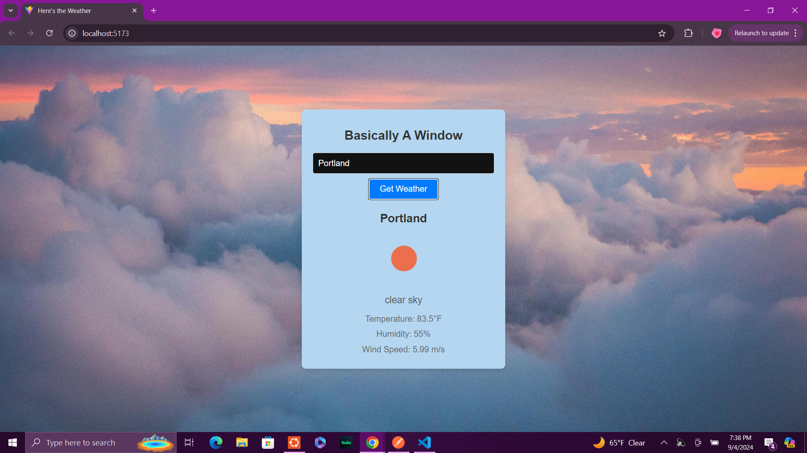

# weatherApiProject
1) Start the backend server by entering the command ```npm start``` from the root directory of the project in your terminal.
2) Start the frontend server by navigating to the frontend directory in the terminal(make sure this is in a seperate terminal from the backend) and entering the command ```npm run dev```.
3) Open the page at http://localhost:5173/
4) Page should look like this:


5) Enter a city name in the input box and click the "Get Weather". The text container should change to include the name of the city entered, an icon representing the current weather condition, a brief description of the current weather, the temperature in degrees farenheit, the humidity, and the wind speed. It should look something like this:


